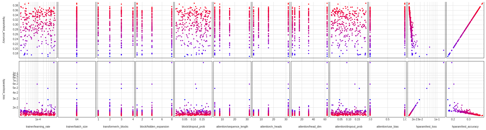

# ImageTransformer

Minimal multi-head self-attention transformer architecture for image classification implemented in PyTorch for education purposes.

# Model

This image transformer implementation uses a simple configuration of stacked transformer blocks without encoder-decoder structure and consists of three main blocks: 

The `ImageToSequence` module transforms image data of shape `(channels, height, width)` to a sequence of token embeddings of shape `(sequence_length, embedding_dim)`. The image to sequence transformation is implemented using a `Conv2d` operation as patch embedding with `kernel_size` = `stride`. Patch embedding downsamples the image and allows transformer architecutes even for images of high resolution. The `ImageToSequence` module is purely linear.

A sequence of stacked `TransformerBlock`s consisting of a `MultiHeadSelfAttention` module followed by a standard fully connected neural network.

Finally, a `Classifier` module takes the output of the last `TransformerBlock` and applies a linear transformation to the network's final prediction.

# Random search

A simple random search method has been implemented to explore the model in more depth and to better understand the interplay of the model's various hyperparameters such as

- sequence length
- token embedding dimensions
- number of attention heads
- number of transformer blocks
- hidden expansion
- dropout probability
- use of bias in self-attention module
- learning rate

# Discussion

Running a few experiments showed that the model's test accuracy improves with an increased number of attention heads, head dimension, and sequence length (in that order). Adding more attention blocks always resulted in higher test accuracy.

# References

[1] An Image is Worth 16x16 Words: https://arxiv.org/pdf/2010.11929.pdf

# License

MIT